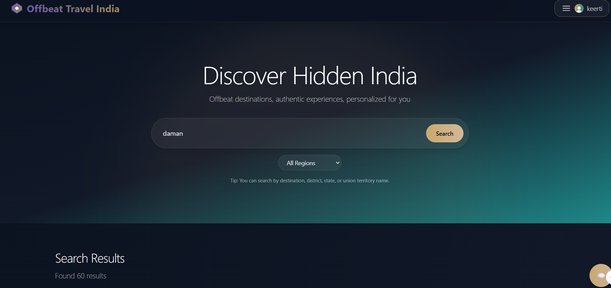
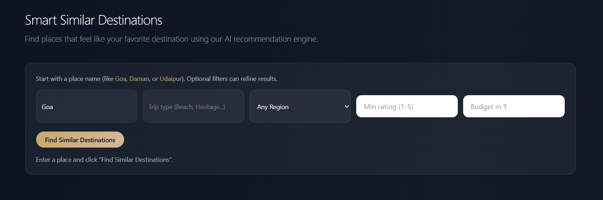
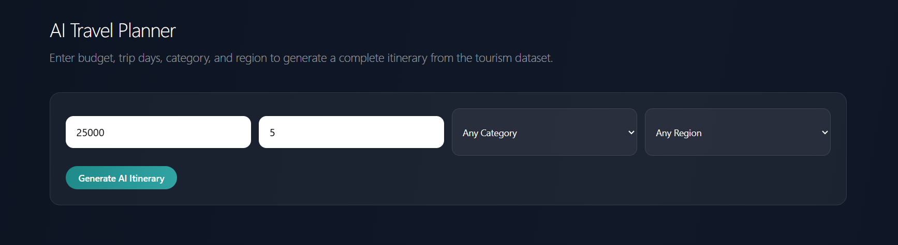
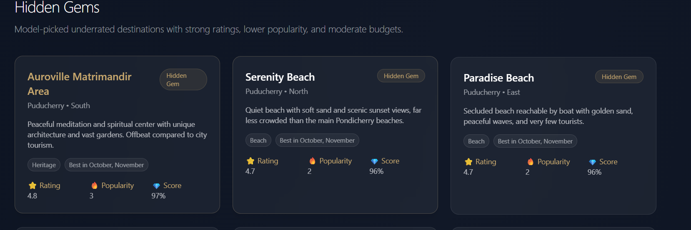
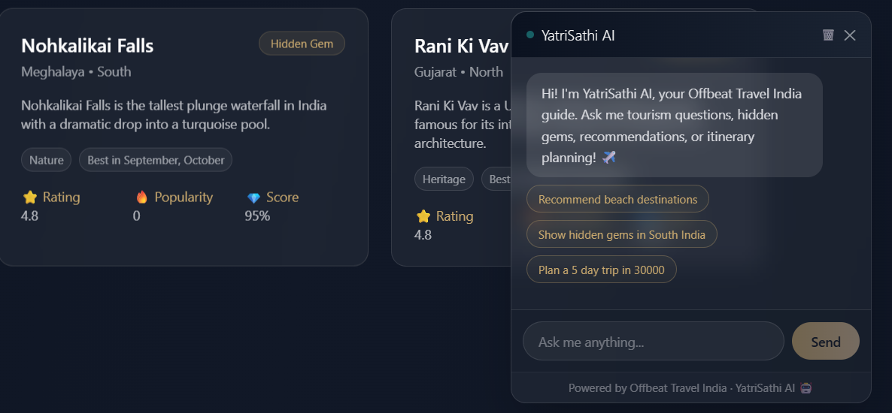

# Offbeat Travel India

Offbeat Travel India is a full-stack travel web app that helps users discover hidden and less-crowded destinations across India.

It combines:

- a modern React frontend,
- a Node/Express API,
- curated tourism datasets,
- and ML-powered recommendation/chatbot features.

## Project overview (simple)

This project is built for 3 main use cases:

1. **Explore places** using search + filters.
2. **Get AI suggestions** (similar destinations, hidden gems, budget planning).
3. **Interact with chatbot** for travel help and itinerary ideas.

In short: **search, discover, and plan trips faster** with both data-driven and AI-assisted features.

## Tech stack

- **Frontend:** React + Vite + Tailwind CSS
- **Backend:** Node.js + Express
- **Database/Data:** JSON datasets + MongoDB/MySQL integration points
- **ML:** Python service (`ml/tourism_knn_api.py`)
- **Auth:** JWT-based user auth flows

## Quick start

### Backend

Create `api/.env`:

```env
NODE_ENV=development
PORT=8001
DB_URL=mongodb://127.0.0.1:27017/myownspace
MONGO_ENABLED=false
MYSQL_HOST=localhost
MYSQL_USER=root
MYSQL_PASSWORD=your_password
MYSQL_DATABASE=myownspace
JWT_SECRET=your_secret_key
CLIENT_URL=http://localhost:5173,http://127.0.0.1:5173
```

Run:

```bash
cd api
npm install
npm run dev
```

### Frontend

Create `client/.env`:

```env
VITE_BASE_URL=http://localhost:8001
VITE_ML_API_URL=http://localhost:5001
```

Run:

```bash
cd client
npm install
npm run dev -- --host
```

### Local URLs

- Frontend: `http://localhost:5173`
- Backend: `http://localhost:8001`

## Project structure (updated)

```text
OTT website/
├─ client/                         # Frontend app (React + Vite)
│  ├─ src/
│  │  ├─ pages/                    # Page-level screens
│  │  ├─ components/               # Reusable UI pieces
│  │  ├─ hooks/                    # Custom React hooks
│  │  ├─ utils/                    # Axios, ML helpers, analytics
│  │  └─ styles/
│  └─ public/
├─ api/                            # Backend API (Express)
│  ├─ controllers/                 # Business logic handlers
│  ├─ routes/                      # API route definitions
│  ├─ models/                      # Mongo/MySQL models
│  ├─ middlewares/                 # Auth and request middleware
│  ├─ config/                      # DB and app configuration
│  └─ data/                        # Tourism/chatbot datasets
├─ ml/                             # Python ML recommendation service
│  └─ tourism_knn_api.py
├─ dataset/                        # Split state/UT dataset files
├─ docs/
│  └─ screenshots/                 # README screenshots
├─ ALGORITHMS.md
├─ DESIGN_SYSTEM.md
├─ DEPLOYMENT.md
└─ README.md
```

## API quick view

- `GET /tourism/search?q=<query>` — search destinations
- `GET /tourism/destination/:name` — destination detail
- `POST /chatbot/chat` — chatbot interaction
- `GET /users/me` — current user profile

## Screenshots

#### 1) Search Bar with Results


#### 2) AI Smart Recommendation


#### 3) Budget Planner


#### 4) Hidden Gems


#### 5) Chatbot


## Notes

- This project merges curated data + ML scoring for better recommendations.
- If an image URL fails in destination cards, the UI now uses local inline fallback images.
- For docs: see `DEPLOYMENT.md`, `DESIGN_SYSTEM.md`, and `ALGORITHMS.md`.
