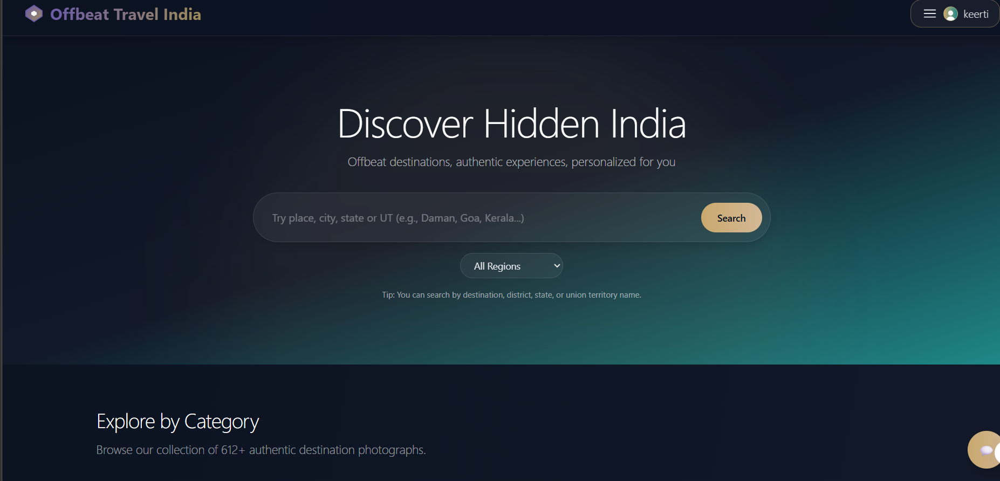
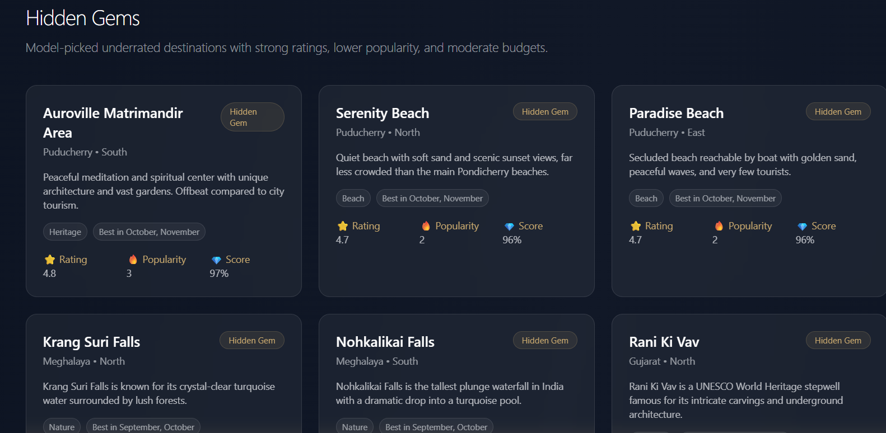
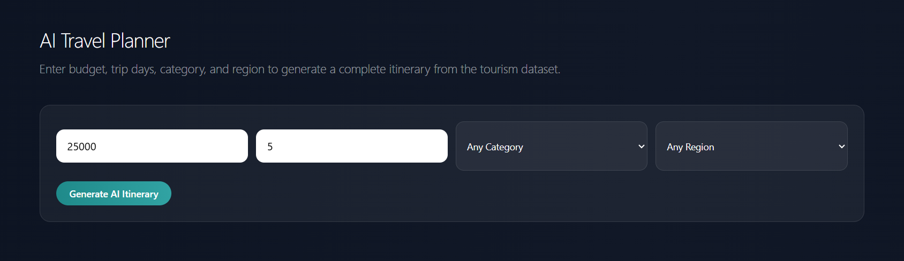
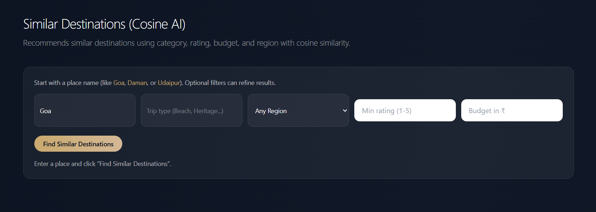
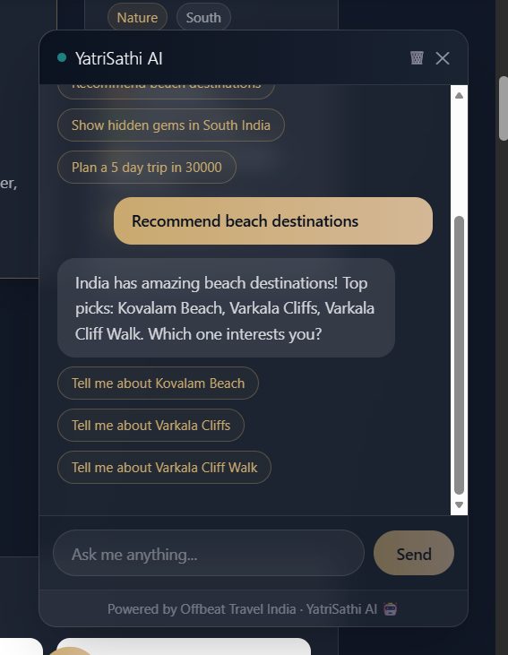

# Offbeat Travel India

Modern React + Node platform to discover offbeat Indian destinations, with ML-assisted search/recommendations and chatbot support.

## Tech stack

- **Frontend:** React + Vite + Tailwind CSS
- **Backend:** Node.js + Express
- **Data layer:** JSON datasets + MongoDB/MySQL integration points
- **ML services:** Python recommendation/search components (`ml/tourism_knn_api.py`)
- **Auth:** JWT-based protected endpoints

## What’s included

- Explore page with semantic + lexical fallback search (handles short and UT/state queries better)
- Similar destinations (cosine-based) with user-friendly inputs
- Premium profile dashboard (host/guest style UX)
- Tourism + dataset APIs with merged `dataset/*.json` loading
- Chatbot with conversation memory follow-ups (budget / best time / trip days)

## Quick start

### 1) Backend

Create `api/.env`:

```env
NODE_ENV=development
PORT=8001
DB_URL=mongodb://127.0.0.1:27017/myownspace
MONGO_ENABLED=false
MYSQL_HOST=localhost
MYSQL_USER=root
MYSQL_PASSWORD=your_password
MYSQL_DATABASE=myownspace
JWT_SECRET=your_secret_key
CLIENT_URL=http://localhost:5173,http://127.0.0.1:5173
```

Run backend:

```bash
cd api
npm install
npm start
```

### 2) Frontend

Create `client/.env`:

```env
VITE_BASE_URL=http://localhost:8001
VITE_ML_API_URL=http://localhost:5001
```

Run frontend:

```bash
cd client
npm install
npm run dev
```

### 3) Optional ML service

If you are running the Python recommendation service separately, start it with your Python environment in the `ml/` directory (as configured in your local setup).

## Localhost troubleshooting

### If localhost keeps failing on backend startup

The most common recurring local issue in this project is MongoDB being installed on Windows but not actually running.

Symptoms:

- backend logs show `ECONNREFUSED 127.0.0.1:27017`
- API appears noisy on every restart
- frontend may load, but backend startup looks broken

For local development, this repository supports a clean fallback mode:

```env
MONGO_ENABLED=false
```

When `MONGO_ENABLED=false` is set in `api/.env`:

- the Express API still runs on `http://localhost:8001`
- MySQL-backed/demo-safe features continue to work
- tourism APIs and chatbot static-data flows still work
- Mongo connection attempts are skipped entirely

If you do want full Mongo-backed features later, set:

```env
MONGO_ENABLED=true
DB_URL=mongodb://127.0.0.1:27017/myownspace
```

and make sure the local MongoDB Windows service is actually running.

### Verified local dev ports

- frontend: `http://localhost:5173`
- backend: `http://localhost:8001`

If you see strange PowerShell results while checking the Vite server, use a raw curl check instead of relying only on `Invoke-WebRequest`.

## API overview (quick)

- `GET /tourism/search?q=<query>` → search places
- `POST /chatbot/chat` → chatbot conversation endpoint
- `GET /users/me` → current authenticated user profile
- `GET /users/me/bookings` → current user bookings
- `GET /users/me/listings` → current user listings

> App routes are mounted under both `/` and `/api` compatibility paths in backend wiring.

## Why data is in different files

This is intentional and helps scalability:

- `offbeat_places.json` = master source
- `dataset/*.json` = per state/UT split files (faster maintenance and updates)
- backend merges all `dataset/*.json` + curated sources into one tourism feed at runtime

So if `Daman` exists in any split file, it should be searchable through tourism endpoints.

## Project structure

```text
OTT website/
├─ client/                 # React + Vite frontend
│  ├─ src/
│  │  ├─ pages/            # Explore, Profile, destination views, etc.
│  │  ├─ components/       # UI components
│  │  └─ hooks/
│  └─ public/
├─ api/                    # Express backend APIs
│  ├─ controllers/         # route handlers
│  ├─ routes/              # API route wiring
│  ├─ models/              # Mongo/MySQL models
│  ├─ middlewares/
│  └─ data/                # tourism/chatbot datasets
├─ ml/                     # Python ML API + recommendation logic
│  └─ tourism_knn_api.py
├─ dataset/                # split state/UT JSON datasets
├─ data_hub/               # organized data mirrors + manifests
├─ scripts/                # data utility scripts
└─ README.md
```

## Screenshots

> Placeholder screenshot assets are now committed in `docs/screenshots/*.svg` so embeds render immediately. Replace each SVG with your real captured screenshot when ready.

### If photos are not loading

1. Make sure you are viewing the **latest pushed commit** on GitHub.
2. Ensure files exist under `docs/screenshots/` with exact names used below.
3. If you replace with `.png` files, update the extension in image paths.
4. Open the file directly (raw view) to verify asset path is valid.

### Embedded screenshots

#### 1) Explore Hero (Goa Search)


#### 2) Similar Destinations Form (Goa)


#### 3) AI Travel Planner Form


#### 4) Hidden Gems Grid


#### 5) Adventure Listings Grid


#### 6) Chatbot Assistant


### Direct asset links (fallback check)

- [01 Explore Hero](docs/screenshots/01-explore-hero-goa-search.png)
- [02 Similar Destinations](docs/screenshots/03-similar-destinations-form-goa.png)
- [03 AI Planner](docs/screenshots/04-ai-travel-planner-form.png)
- [04 Hidden Gems](docs/screenshots/05-hidden-gems-grid.png)
- [05 Adventure Listings](docs/screenshots/06-adventure-listings-grid.png)
- [06 Chatbot Assistant](docs/screenshots/07-chatbot-assistant.svg)

## Quick API checks (post setup)

Once backend is running, these quick checks help confirm core features:

- Search: `GET /tourism/search?q=goa`
- Chatbot: `POST /chatbot/chat`
- Auth profile (token required): `GET /users/me`

If the frontend loads but API fails, verify `VITE_BASE_URL` points to backend port `8001`.

## Useful docs

- `DEPLOYMENT.md`
- `DESIGN_SYSTEM.md`
- `ALGORITHMS.md`

## Notes

- This repository intentionally uses split datasets and merged runtime loading for scalability.
- Search includes semantic + lexical fallback to avoid empty-result dead ends for short/ambiguous queries.
- Profile page is wired to real backend user endpoints (no fake seeded profile cards).

---

_README refreshed: architecture, API quick guide, and screenshot troubleshooting added (2026-03-16)._
