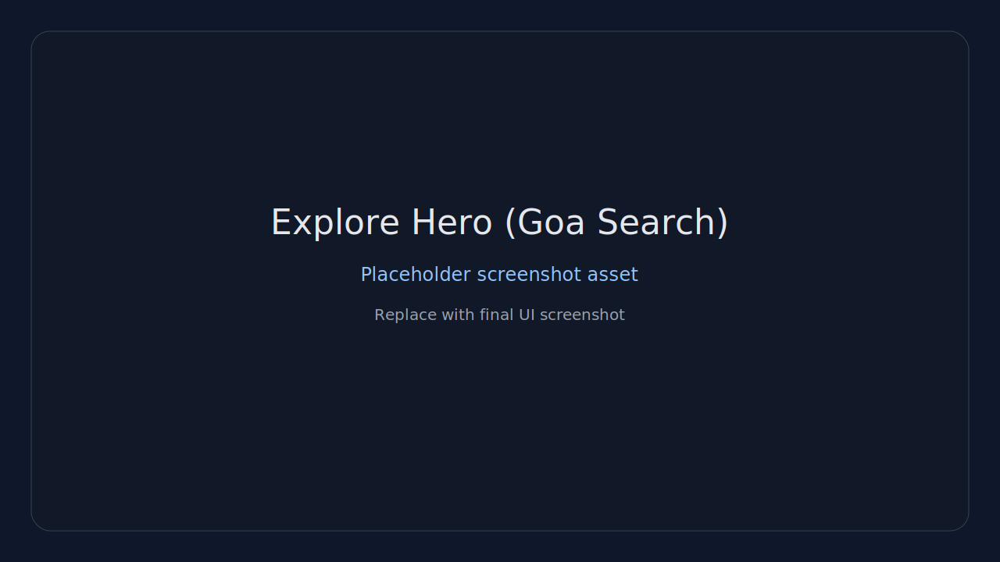
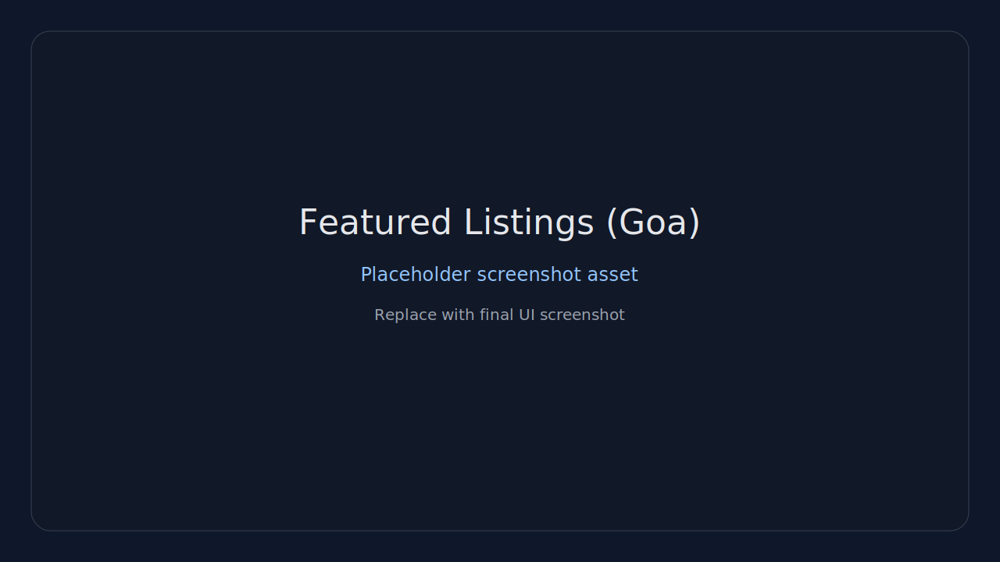
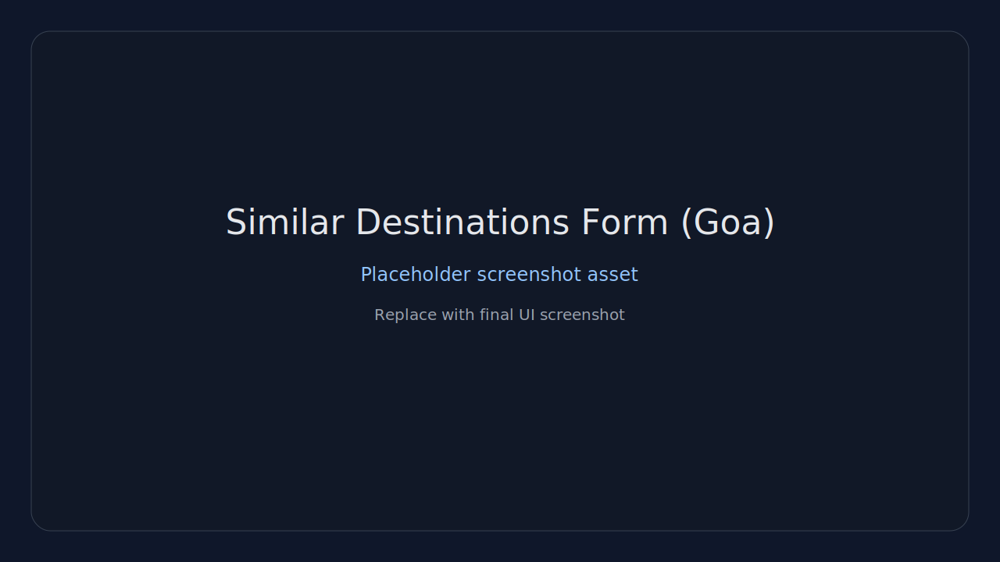
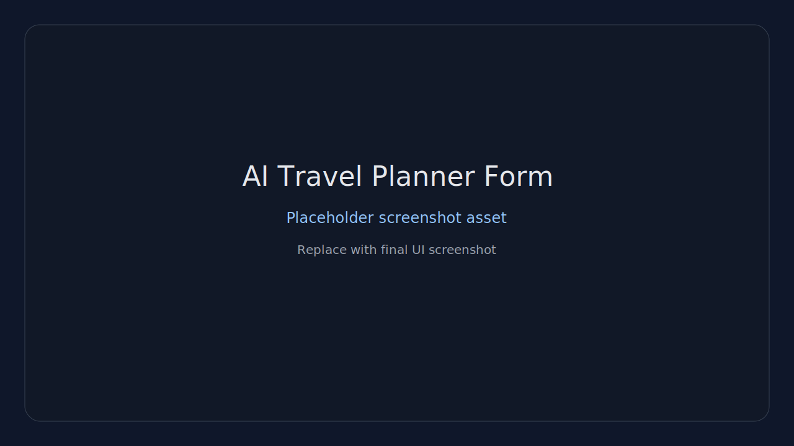
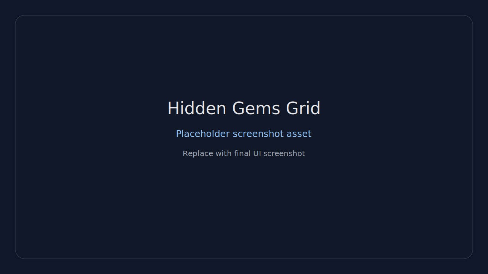
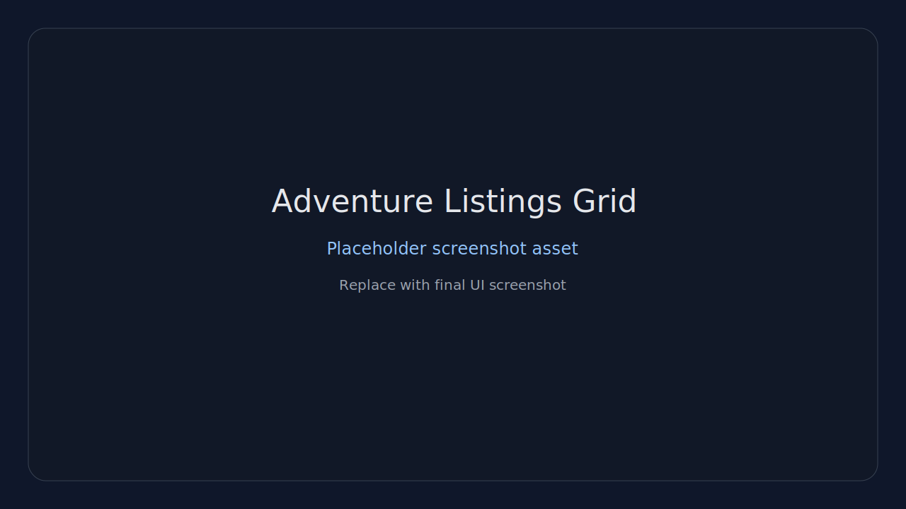
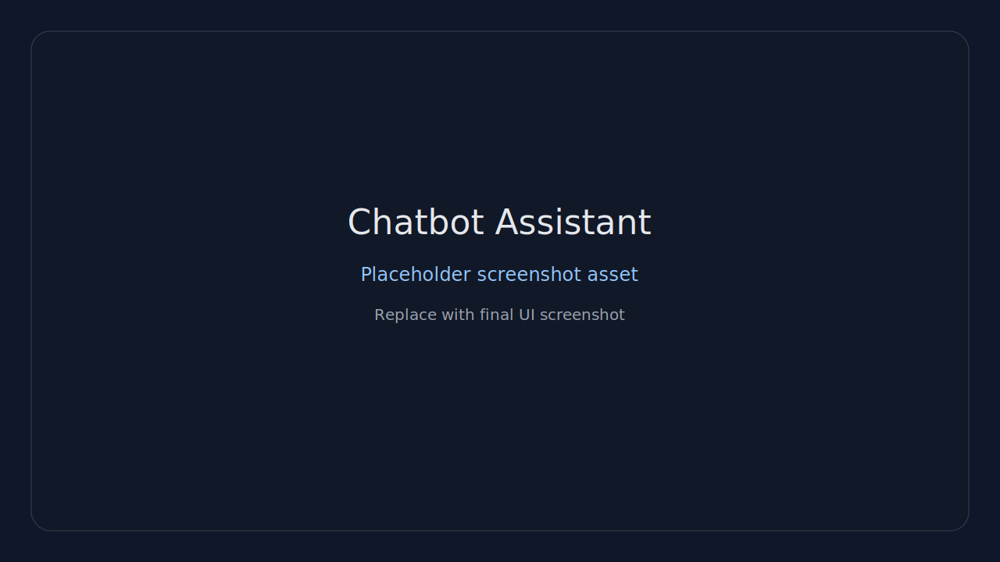
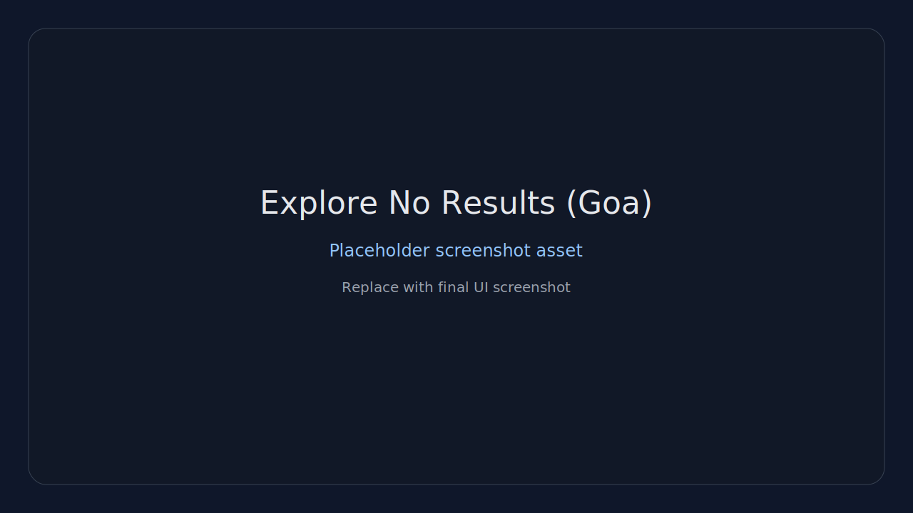

# Offbeat Travel India

Modern React + Node platform to discover offbeat Indian destinations, with ML-assisted search/recommendations and chatbot support.

## What’s included

- Explore page with semantic + lexical fallback search (handles short and UT/state queries better)
- Similar destinations (cosine-based) with user-friendly inputs
- Premium profile dashboard (host/guest style UX)
- Tourism + dataset APIs with merged `dataset/*.json` loading
- Chatbot with conversation memory follow-ups (budget / best time / trip days)

## Quick start

### 1) Backend

Create `api/.env`:

```env
PORT=8001
MONGODB_URI=mongodb://localhost:27017/travel-db
MYSQL_HOST=localhost
MYSQL_USER=root
MYSQL_PASSWORD=your_password
MYSQL_DATABASE=travel_db
JWT_SECRET=your_secret_key
CLIENT_URL=http://localhost:5173
```

Run backend:

```bash
cd api
npm install
npm start
```

### 2) Frontend

Create `client/.env`:

```env
VITE_BASE_URL=http://localhost:8001
VITE_ML_API_URL=http://localhost:5001
```

Run frontend:

```bash
cd client
npm install
npm run dev
```

## Why data is in different files

This is intentional and helps scalability:

- `offbeat_places.json` = master source
- `dataset/*.json` = per state/UT split files (faster maintenance and updates)
- backend merges all `dataset/*.json` + curated sources into one tourism feed at runtime

So if `Daman` exists in any split file, it should be searchable through tourism endpoints.

## Project structure

```text
OTT website/
├─ client/                 # React + Vite frontend
│  ├─ src/
│  │  ├─ pages/            # Explore, Profile, destination views, etc.
│  │  ├─ components/       # UI components
│  │  └─ hooks/
│  └─ public/
├─ api/                    # Express backend APIs
│  ├─ controllers/         # route handlers
│  ├─ routes/              # API route wiring
│  ├─ models/              # Mongo/MySQL models
│  ├─ middlewares/
│  └─ data/                # tourism/chatbot datasets
├─ ml/                     # Python ML API + recommendation logic
│  └─ tourism_knn_api.py
├─ dataset/                # split state/UT JSON datasets
├─ data_hub/               # organized data mirrors + manifests
├─ scripts/                # data utility scripts
└─ README.md
```

## Screenshots

> Placeholder screenshot assets are now committed in `docs/screenshots/*.svg` so embeds render immediately. Replace each SVG with your real captured screenshot when ready.

### Embedded screenshots

#### 1) Explore Hero (Goa Search)


#### 2) Featured Listings (Goa)


#### 3) Similar Destinations Form (Goa)


#### 4) AI Travel Planner Form


#### 5) Hidden Gems Grid


#### 6) Adventure Listings Grid


#### 7) Chatbot Assistant


#### 8) Explore No Results (Goa)


## Useful docs

- `DEPLOYMENT.md`
- `DESIGN_SYSTEM.md`
- `ALGORITHMS.md`

---

_Docs metadata refresh: 2026-03-16 (non-functional documentation-only update)._
